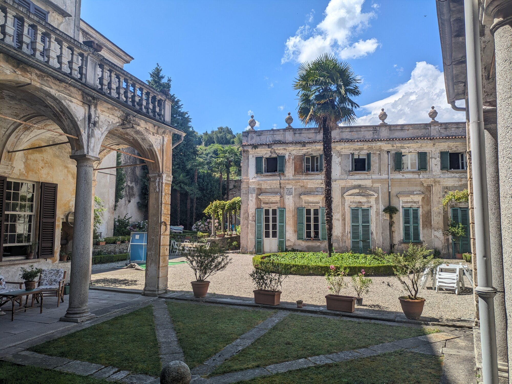

*Il giardino e le "Casacce"*

Questo è il sito web di Casa Usellini, situata ad Arona in via Pertossi, nel cuore del centro storico della città. Qui potrete trovare articoli sugli eventi futuri e la storia della casa, oltreché una galleria di immagini del giardino e delle costruzioni che la compongono.

## Eventi dell'estate 2026

- 7 agosto 2026, Festival LagoMaggioreMusica - Danilo Rossi e Trio Felice
- 14 agosto 2026, Festival LagoMaggioreMusica - Aozhe Zang, violino, I Premio Paganini 2025
- 21 agosto 2026, Festival LagoMaggioreMusica - Alexander Kashpurin, I Premio Liszt 2026
- 28 agosto 2026, Festival LagoMaggioreMusica - Isidore String Quartet, I Premio Banff 2024
