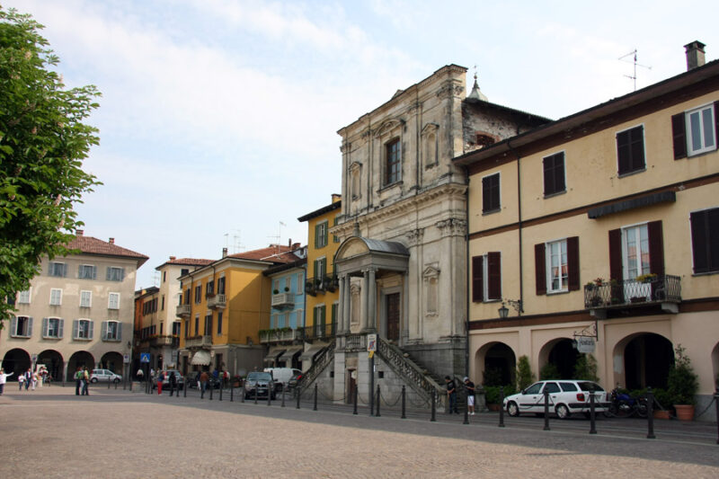
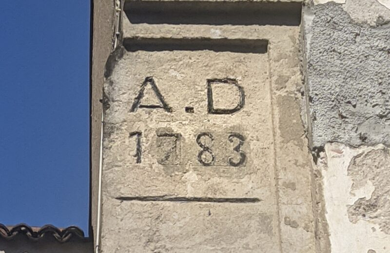
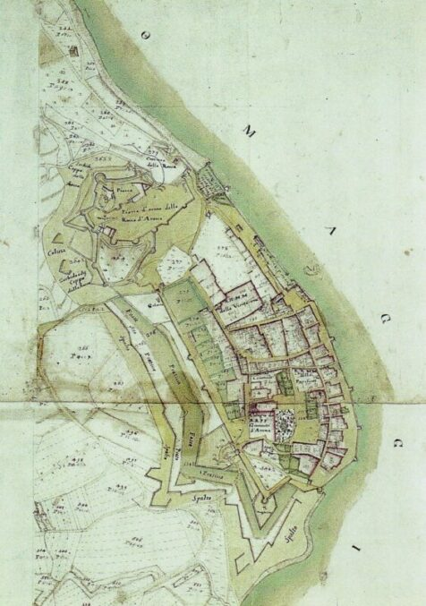

L'edificio denominato Palazzo Usellini si trova nel centro storico del Comune di Arona, una cittadina sulla sponda piemontese del Lago Maggiore, in Via Pertossi, l’antica strada carrale che portava al porto della città, attivo fino al principio del 1900 quando fu trasformato nella attuale Piazza del Popolo. Via Pertossi è una strada in leggera salita che dalla Piazza del Popolo sale verso via S. Carlo, dove si trova ubicato l’immenso Convento della Visitazione.

*Piazza del popolo e la chiesa di Santa Marta*

Il complesso degli edifici del Palazzo che si presenta attualmente risale alla fine del ‘700, precisamente al 1783, data che è riportata sui diversi edifici, ma il nucleo centrale è di datazione molto più antica. Risalgono al 1530 il corpo centrale prospiciente alla Via Pertossi, il portico interno e la porta che, attraverso un piccolo cortile, comunica con la Chiesa di Santa Marta.

*La data scritta sulle “Casacce”*

Dall’esame delle antiche mappe della città non è possibile ricostruire le caratteristiche degli edifici preesistenti al 1783, e stabilire se facessero parte della Chiesa di Santa Marta, del Convento o di entrambe le strutture. Non esistono neppure documenti relativi all’acquisto della proprietà da parte di Carlantonio Usellini, nella seconda metà del ‘700.

*Mappa terensiana della città di Arona*

Carlantonio Usellini (1741-1816)  all’età di 31 anni chiese al padre Filippo  l’emancipazione e, con la quota ereditata, lasciò le sponde del Lago Maggiore  per trasferirsi in Olanda dove, ad Amsterdam, iniziò un’attività commerciale che si rivelò fiorentissima. La famiglia Usellini era originaria di un piccolo paese dell’Alto Vergante e le prime notizie risalgono a un Lorenzo Usellini (1636-1710) di Corciago. Era una famiglia di possidenti terrieri, con proprietà in diversi comuni del novarese (Gattico, Oleggio, Arona, Suno), ma Carlantonio non seguì questa attività se non più tardi, al suo ritorno dall’Olanda. Ad Amsterdam costituì col fratello Pietro Maria (che lo raggiunse in Olanda) una società commerciale di import-export di prodotti di pregio: dagli acciai inglesi, ai tessuti delle Fiandre, alle porcellane tedesche agli oggetti di antiquariato. Viaggiò in Francia, Inghilterra e Germania sviluppando una rete di vendita bel oltre il mercato olandese. Ad Amsterdam trasferirono anche la moglie e le due figlie. Si recava sovente in Italia con lunghi viaggi su diligenze di posta e nel 1792, all’età di  51 anni, dopo aver ceduto con grande vantaggio economico la sua avviatissima società al fratello Pietro Maria, ritornò ad Arona, dove decise di vivere  nella casa  da lui acquistata  in Via Pertossi. Da memorie tramandate, sembra che egli abbia dato incarico ad un ignoto architetto olandese di realizzare un modello ligneo della facciata, che desiderava riprendesse le forme del barocco olandese, ora non più evidenti essendo state sostituite le caratteristiche finestre olandesi a saliscendi e a riquadri (di cui solo all’interno esiste ancora qualche esempio), con le imposte attuali e relative griglie.

All’interno invece fu mantenuto il portico originale di tre bracci e nel giardino all’italiana retrostante furono costruiti due edifici indipendenti destinati ai servizi: “gli Stallini”, per i cavalli e “le Casacce”, con la sala da ballo e del biliardo.

Carlantonio arredò la dimora con mobili e oggetti di pregio, molti importati dall’Olanda ed oggi in buona parte dispersi tra eredi e furti. Alla sua morte sopravvissero due figlie ed un unico maschio, Filippo (1809-1872), che amministrò ed ampliò le proprietà e fu Sindaco di Corciago e poi di Arona. Nel 1834 sposò Guglielmina Brielli, figlia di Pietro Brielli, novarese, Senatore del Regno con Carlo Alberto, Sindaco di Novara e ricco proprietario terriero (soprattutto di ampie risaie). Ebbero 16 figli, con molte morti premature, l’ultimo dei quali Lorenzo (1856-1925) ebbe in eredità la casa di Arona.

Lorenzo Usellini si trasferì a Milano dove nel 1882, fondò un’azienda per l’importazione, la produzione e la distribuzione di profumi e cosmetici attiva fino a fine ‘900. La proprietà di Arona venne quindi utilizzata esclusivamente nei mesi estivi dalla famiglia.

Dei sei figli di Lorenzo vanno ricordati [Gianfilippo Usellini](https://it.wikipedia.org/wiki/Gianfilippo_Usellini) (1904-1971), uno dei più significativi pittori italiani del ‘900, nella cui pittura si ritrovano scorci e architetture della casa di famiglia e [Guglielmo Usellini](http://www.ause.eu/public/medias/2008_2_2008_M_MARONGIU.pdf) (1906-1958) che fu un convinto sostenitore del Movimento Federalista Europeo di cui fu Segretario Generale fino alla sua morte a Parigi.

Casa Usellini, membro di ADSI (Associazione Italiana Dimore Storiche) è ora la sede, durante i mesi estivi ,di varie attività culturali, ed è tuttora abitata dai membri della famiglia.
